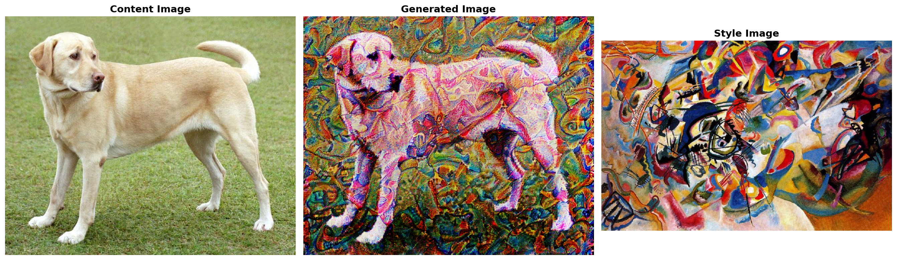
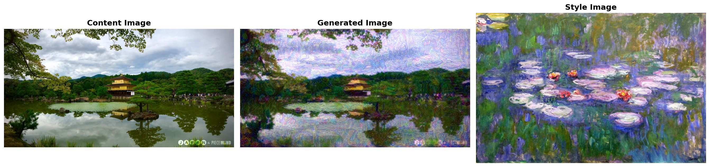

# Neural Style Transfer Examples

This document showcases different style transfer results with their corresponding configurations. All examples use the same content and style images but with different parameter settings to demonstrate the impact of various configurations.

---

## Example 1: Balanced Style Transfer


**Configuration:**
```python
STYLE_LAYERS = ['relu1_1', 'relu3_3', 'relu4_3']
STYLE_WEIGHTS = [2.0, 1.5, 1.0]
CONTENT_LAYER = 'relu4_2'
ALPHA = 1
BETA = 1e6
MAX_SIDE = 1280
ADAM_ITERS = 200
LBFGS_ITERS = 300
PYRAMID_LEVELS = 3
ADAM_LR = 0.02
LBFGS_LR = 1.0
APPLY_HISTOGRAM_MATCHING = False
HISTOGRAM_MATCHING_TARGET = 'content'
```

**Key Parameters:**
- Content weight: `1`
- Style weight: `1e6`
- Histogram matching: `Disabled`

**Result:** A balanced style transfer with moderate style application while preserving content structure. This serves as a good baseline configuration.

---

## Example 2: Heavy Stylization with Color Matching



**Configuration:**
```python
STYLE_LAYERS = ['relu1_1', 'relu3_3', 'relu4_3']
STYLE_WEIGHTS = [1.5, 1.0, 1.0]
CONTENT_LAYER = 'relu4_2'
ALPHA = 1e3
BETA = 1e8
MAX_SIDE = 1280
ADAM_ITERS = 200
LBFGS_ITERS = 300
PYRAMID_LEVELS = 3
ADAM_LR = 0.02
LBFGS_LR = 1.0
APPLY_HISTOGRAM_MATCHING = True
HISTOGRAM_MATCHING_TARGET = 'style'
```

**Key Parameters:**
- Content weight: `1e3` (increased from Example 1)
- Style weight: `1e8` (100x stronger than Example 1)
- Histogram matching: `Enabled` → `style`

**Result:** More aggressive style application with color distribution matched to the style image. The higher BETA value creates a more artistic, heavily stylized output while histogram matching ensures the colors align with the style reference.

---

## Example 3: Intense Style with Emphasis on Texture Extremes



**Configuration:**
```python
STYLE_LAYERS = ['relu1_1', 'relu3_3', 'relu4_3']
STYLE_WEIGHTS = [5.0, 1.5, 5.0]
CONTENT_LAYER = 'relu4_2'
ALPHA = 1
BETA = 1e8
MAX_SIDE = 1280
ADAM_ITERS = 200
LBFGS_ITERS = 300
PYRAMID_LEVELS = 3
ADAM_LR = 0.02
LBFGS_LR = 1.0
APPLY_HISTOGRAM_MATCHING = False
HISTOGRAM_MATCHING_TARGET = 'style'
```

**Key Parameters:**
- Content weight: `1`
- Style weight: `1e8` (100x stronger than Example 1)
- Style layer weights: `[5.0, 1.5, 5.0]` (emphasizes shallow and deep layers)
- Histogram matching: `Disabled`

**Result:** Extremely stylized output with enhanced fine textures (relu1_1) and abstract features (relu4_3). The unbalanced style weights create a unique artistic effect by prioritizing both detailed patterns and high-level style characteristics.

---

## Parameter Comparison

| Parameter | Example 1 | Example 2 | Example 3 |
|-----------|-----------|-----------|-----------|
| ALPHA (Content) | 1 | 1e3 | 1 |
| BETA (Style) | 1e6 | 1e8 | 1e8 |
| Style Weights | [2.0, 1.5, 1.0] | [1.5, 1.0, 1.0] | [5.0, 1.5, 5.0] |
| Histogram Matching | Off | On (style) | Off |
| Style Intensity | Moderate | Heavy | Very Heavy |

---

## Key Takeaways

1. **BETA (Style Weight)**: Most impactful parameter for controlling style intensity
   - `1e6`: Moderate stylization (Example 1)
   - `1e8`: Heavy stylization (Examples 2 & 3)

2. **ALPHA (Content Weight)**: Balances content preservation
   - Low values allow more style freedom
   - Higher values (Example 2: `1e3`) preserve more content structure

3. **Style Layer Weights**: Control which features dominate
   - Balanced weights: Uniform style application
   - Emphasizing shallow layers: More texture detail
   - Emphasizing deep layers: More abstract style features

4. **Histogram Matching**: Aligns color distribution
   - Useful when colors appear washed out or oversaturated
   - `'style'` target: Output colors match style reference
   - `'content'` target: Output colors match original content

---

## Recommendations

- **Start with Example 1** configuration for most use cases
- **Increase BETA** (1e7 to 1e9) for more artistic/abstract results
- **Enable histogram matching** if colors don't look right
- **Adjust style weights** to emphasize specific features (textures vs. abstract patterns)
- **Experiment with ALPHA** to find the right content-style balance for your images